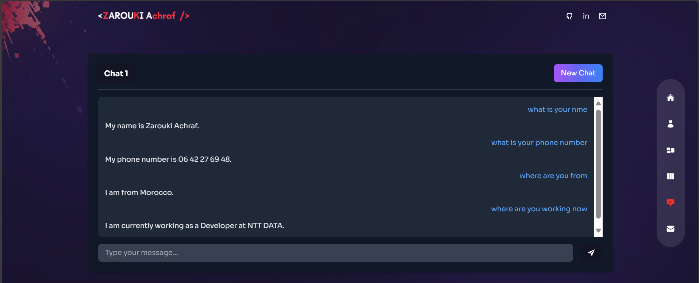

# Achraf Zarouki - Portfolio

At NTT DATA, I gained extensive experience working as a Java developer while simultaneously
pursuing a master's degree. This period was a transformative time where I not only honed my
technical skills in Java and other technologies but also undertook Spanish language training,
enriching both my professional and personal development. Balancing a demanding work schedule
with academic responsibilities taught me effective time management, enabling me to excel in both
areas. Building on this foundation, I am now embarking on a PhD in Artificial Intelligence a long
held goal and an exciting new challenge that I am eager to embrace.

Here, you can chat with a chatbot that responds just like I would, providing you with everything about me.

